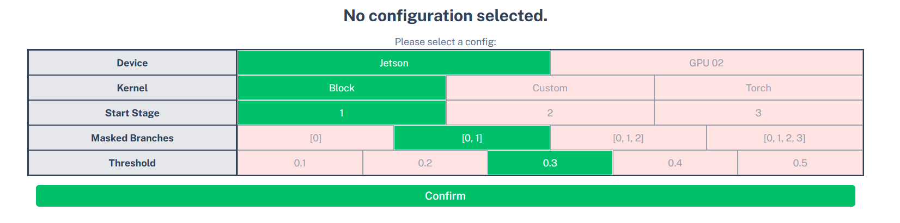
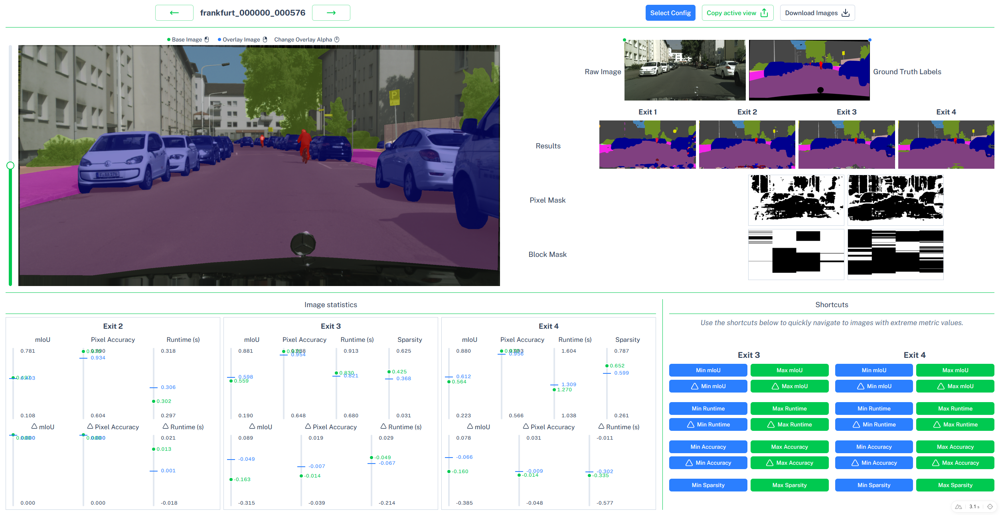

# Qualitative Analysis Tool

A small Nuxt application for the qualitative analysis of sparse anytime prediction for semantic segmentation.

The tool makes it possible to inspect an image at several prediction exits and compare:

- the raw input image;
- the ground-truth labels;
- the prediction produced at each exit;
- the pixel mask used for sparse convolution; and
- the block mask used for sparse convolution.

It also presents image-level statistics for each exit, including mean IoU, runtime, and sparsity when it is available.

## Example data

The repository references three example images from the [Cityscapes dataset](https://www.cityscapes-dataset.com/). Each example has a left camera image and a Cityscapes ground-truth label image in the dataset directory, as well as intermediate segmentation predictions and sparse-convolution masks in the configured results directory:

- `frankfurt_000000_000576`
- `frankfurt_000000_001016`
- `munster_000173_000019`

The examples come from the Cityscapes `frankfurt` and `munster` sequences. The application starts with the first Frankfurt example. Use the previous and next controls in the header to move through the available image IDs.

## Selecting a Configuration


Before opening the comparison view, select a prediction configuration by choosing the device, kernel, start stage, masked branches, and threshold. The five configuration categories are fixed in the interface, while the available combinations are loaded from `configs.json`.

The application expects a `configs.json` file in the directory specified by the `NUXT_RESULTS_PATH` environment variable. Only configurations listed in this file can be selected. The `results` directory structure encodes the selected configuration parameters.


## Using the Analysis View



The Analysis View is divided into three main sections:

1. **Header:** Use the previous and next buttons to navigate through the available images. Only images with available results are shown. On the right, you can select a different configuration when multiple analysis runs are available. You can also copy the active view, including the selected image and configuration, to share it with colleagues.

2. **Image Comparison View:** This section allows you to compare two images. The base image is marked with a green dot in the top-left corner, while the overlay image is marked with a blue dot in the top-right corner. The overlay is displayed on top of the base image, and its opacity can be adjusted with the vertical slider or the mouse wheel.

   Select a new base image with the left mouse button and a new overlay image with the right mouse button. Hold the `Alt` key while scrolling to change the opacity in larger increments.

3. **Statistics:** The image statistics are shown below the comparison view and are grouped by exit. The available metrics are mIoU, runtime, and sparsity. The minimum, maximum, and average values are calculated from `results.json`. The average is marked with a blue dot, while the value for the currently selected image is indicated by a green line.

   The Class Statistics panel on the right is not implemented yet. It is planned to show the number of classes present in the image and compare the mIoU of each class with the corresponding mIoU across the complete dataset.


## Requirements

- Node.js compatible with the installed Nuxt version
- `pnpm` 11 or newer

## Setup

Install the dependencies:

```bash
pnpm install
```

Start the development server at `http://localhost:3000`:

```bash
pnpm dev
```

Other useful commands:
```bash
pnpm lint       # Run ESLint
pnpm typecheck  # Run Nuxt/Vue TypeScript checks
pnpm build      # Build for production
pnpm preview    # Preview the production build locally
```

## Data format

The application uses two data roots:

- `NUXT_DATASET_PATH` points to the original Cityscapes dataset. The default is `/scratch/datasets/cityscapes`.
- `NUXT_RESULTS_PATH` points to the qualitative-analysis results. The default is `/scratch/qual-results`.

### Configuration index

The top level of `NUXT_RESULTS_PATH` must contain a `configs.json` file. It contains an array of configurations that can be selected in the application:

```json
[
  {
    "device": "jetson",
    "kernel": "block",
    "startStage": 1,
    "branches": 1,
    "threshold": 3
  }
]
```

Each configuration is stored in a directory whose path is built from its values:

```text
<NUXT_RESULTS_PATH>/
  configs.json
  <device>/<kernel>/<startStage>/<branches>/<threshold>/
    results.json
    <image-id>/
      exit1_prediction.png
      exit2_prediction.png
      exit3_prediction.png
      exit4_prediction.png
      exit2_pixel_mask.png
      exit3_pixel_mask.png
      exit4_pixel_mask.png
      exit2_block_mask.png
      exit3_block_mask.png
      exit4_block_mask.png
```

Only configurations listed in `configs.json` can be selected. The `results.json` file inside each configuration directory contains the image-level metrics. Its top-level keys must match the image IDs, and each image contains one object per prediction exit:

```json
{
  "image_id": {
    "exit1": {
      "time_s": 0.145,
      "mean_IoU": 0.352,
      "pixel_acc": 0.936,
      "mean_acc": 0.388
    },
    "exit2": {
      "time_s": 0.291,
      "mean_IoU": 0.497,
      "pixel_acc": 0.970,
      "mean_acc": 0.540,
      "sparsity": 0.188
    },
    "exit3": {
      "time_s": 0.711,
      "mean_IoU": 0.715,
      "pixel_acc": 0.985,
      "mean_acc": 0.763,
      "sparsity": 0.421
    },
    "exit4": {
      "time_s": 1.105,
      "mean_IoU": 0.728,
      "pixel_acc": 0.986,
      "mean_acc": 0.780,
      "sparsity": 0.671
    }
  }
}
```

`sparsity` is optional in the input data. Missing values are treated as `0` by the application; the bundled examples omit it for `exit1`.

### Dataset images

The real images and ground-truth images are read from the original Cityscapes dataset specified by `NUXT_DATASET_PATH`; they are not copied into each results directory. For an image ID such as `frankfurt_000000_000576`, the application expects:

```text
<NUXT_DATASET_PATH>/
  leftImg8bit/val/<city>/<image-id>_leftImg8bit.png
  gtFine/val/<city>/<image-id>_gtFine_color.png
```

The `<city>` directory is derived from the first part of the image ID, such as `frankfurt` or `munster`. Adding a new image requires the corresponding Cityscapes files and an entry with metrics in the configuration's `results.json` file. The application is not yet a general-purpose dataset importer.

## Project structure

```text
app/
  app.vue                         Main comparison view and interactions
  components/                     Image previews, configuration, comparison, and statistics
  composables/stores/             Pinia stores for configuration and result data
  server/api/                     API endpoints for configs, images, and results
  shared/                         Shared prediction configuration and path helpers
  docs/images/                    README screenshots
  NUXT_DATASET_PATH/              Original Cityscapes images and labels
    leftImg8bit/val/<city>/       Real camera images
    gtFine/val/<city>/            Ground-truth label images
  NUXT_RESULTS_PATH/
    configs.json                  Available prediction configurations
    <device>/<kernel>/<startStage>/<branches>/<threshold>/
      results.json                Image-level metrics for this configuration
      <image-id>/                 Predictions and sparse-convolution masks
```

## Current limitations and future improvements

The current implementation is intentionally focused on the included examples and has several hard-coded assumptions: four exits, fixed file names, one results file, and one active configuration. The class statistics panel is present in the layout but is not implemented yet.

Planned improvements:

- add per-class statistics;
- add configurable configuration and dataset settings;
- make the number of exits and analysed statistic types data-driven;
